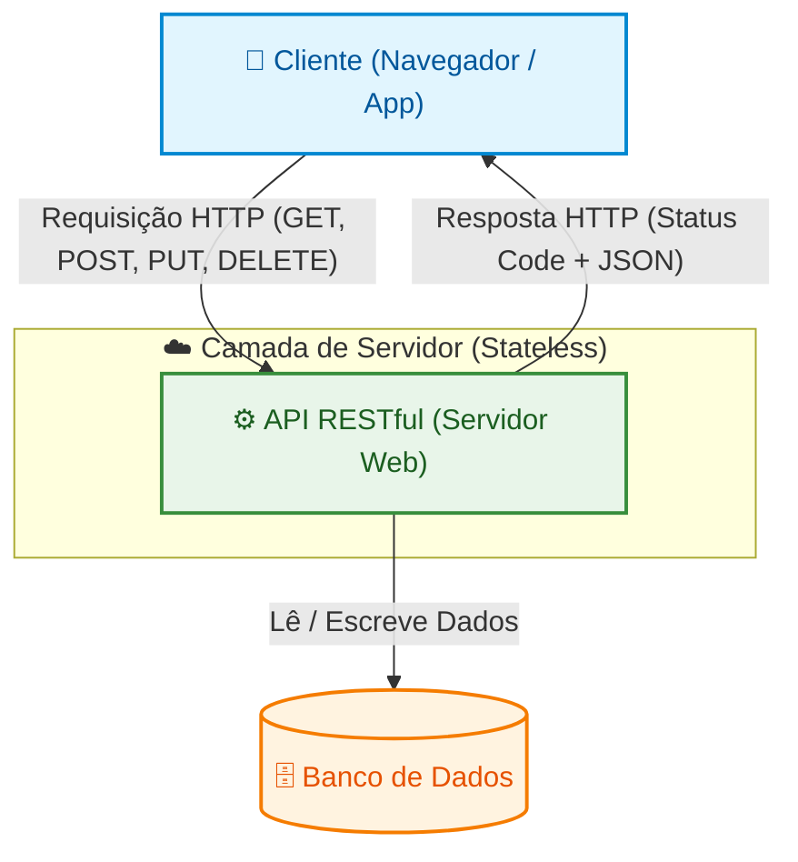

# 🌐 Guia Definitivo: API REST vs RESTful

> Apesar de frequentemente usados como sinônimos, **REST** e **RESTful** têm significados ligeiramente diferentes. Entenda de uma vez por todas a diferença e as características de cada um! 🚀

---

## 🛠️ O que é REST?

**REST** (*Representational State Transfer*) é um **estilo arquitetural** para o design de aplicações em rede, proposto por Roy Fielding no ano de 2000. 

Ele define um conjunto de restrições (ou princípios) que, quando aplicadas a um sistema, garantem que ele seja:
✅ Escalável  
✅ Simples  
✅ De fácil manutenção  

### 📌 Princípios do REST:

| Princípio | Descrição |
| :--- | :--- |
| 🧑‍💻 **Cliente-Servidor** | Interface do usuário (cliente) e armazenamento de dados (servidor) são separados. Evoluem de forma independente. |
| 🚫 **Stateless** | O servidor não guarda o estado do cliente. Cada requisição é independente e deve conter todos os dados necessários. |
| ⚡ **Cacheabilidade** | As respostas devem indicar se podem ser cacheadas, melhorando a velocidade e economizando rede. |
| 📏 **Interface Uniforme** | Regras de comunicação padronizadas (ex: métodos HTTP consistentes). É o coração do REST! |
| 🥞 **Sistema em Camadas** | O cliente não sabe se está falando com o servidor final ou com intermediários (proxies, load balancers). |
| 📜 **Código sob Demanda** | *(Opcional)* O servidor pode enviar código executável para o cliente (ex: scripts JS). |

---

## 💻 O que é RESTful?

Enquanto REST é o *conceito*, **RESTful** é o termo usado para descrever a aplicação prática: um serviço web ou API que **implementa e respeita os princípios do REST**.

### ✨ Características de uma API RESTful na Prática:

**1. 🏷️ URIs lógicas baseadas em recursos:**
As URLs representam substantivos, não verbos.
* ✅ *Correto:* `GET /usuarios`, `POST /produtos`
* ❌ *Incorreto:* `GET /getUsuarios`, `POST /criarProduto`

**2. 🚦 Uso semântico dos Métodos HTTP:**
* **`GET`**: 📖 Lê e recupera dados.
* **`POST`**: ➕ Cria novos recursos.
* **`PUT / PATCH`**: 🔄 Atualiza dados (PUT substitui, PATCH atualiza parcialmente).
* **`DELETE`**: 🗑️ Remove dados.

**3. 📦 Formato de Representação Padrão:**
O queridinho do mercado atual é o **JSON** 📄, mas XML e outros também são aceitos.

**4. 📋 Status Codes Adequados:**
A API deve ser educada e responder com o código certo:
* `200 OK` / `201 Created` / `204 No Content` 🎉
* `400 Bad Request` / `401 Unauthorized` / `404 Not Found` ⚠️
* `500 Internal Server Error` 💥

**5. 🔗 HATEOAS:**
Nível máximo de maturidade! A API envia links nas próprias respostas indicando os próximos passos possíveis (ex: links para editar ou apagar o recurso recém-criado).

---

## 🎯 Resumo da Ópera

* 🧠 **REST:** A ideia, a teoria, as regras da arquitetura.
* 🛠️ **RESTful:** A mão na massa, o sistema construído seguindo essas regras.

---

## 🏗️ Arquitetura Visual (Diagrama)

Abaixo, a representação de como a mágica acontece nos bastidores:

### 💡 O que o diagrama nos mostra:
* **Separação Cliente-Servidor:** O Front-end 🎨 não se mete no Back-end ⚙️.
* **Interface Uniforme:** A língua universal falada é HTTP + JSON.
* **Stateless:** A API não tem memória da requisição anterior. O cliente que lute pra mandar tudo mastigadinho! 🧩
